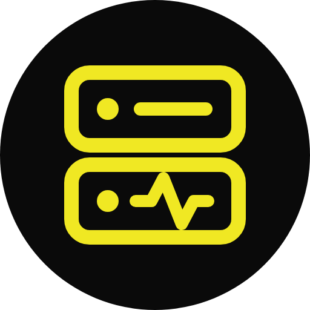

<div align="center">



# InfiniAnalytics Agent

**The server agent that says why the machine went away.**

A small program installed on a client's server that sends its CPU, memory, disks, network and
Docker containers to InfiniAnalytics every 10 seconds — and when the machine goes away, tells
you **why**: reboot, shutdown, crash, agent stopped or no connection. The dashboard shows it
under **Infraestructura → Servidores**.

[](https://go.dev)
[](#install)
[](#install)
[](#docker)
[](#license)

</div>

---

## Features

- 📦 **One Static Binary** — per platform (Linux and Windows, amd64 and arm64), no runtime dependencies, ~10 MB of memory, capped by its service at 20 % of one core
- 📈 **Sampling** — vitals every 2 s, folded into a 10 s window: min / mean / max of CPU and memory, mean / max of swap, network and disk throughput, the busiest single core, load and temperature. The per-core list is only sent as the current reading. Filesystems every 60 s
- 🐳 **Containers** — once per window, the busiest 50 containers by CPU + memory (stopped ones fill any room left), keyed by compose `project/service` so a redeploy continues the same series
- 📣 **Docker Events** — the event stream adds starts, stops, crashes with exit codes, OOM kills, restarts, health changes and deploys (a start on a new image)
- 🧩 **Modules** — host vitals are always sent; disk space and Docker (stats and events) are on by default and can each be turned off, and then are neither read nor sent. See [Modules](#modules)
- 💾 **Spool** — every closed window is written to an append-only, fsynced spool before it is pushed, and removed once the backend acknowledges it. While the backend is unreachable it keeps up to 48 h / 50 MB (oldest dropped first) and drains oldest-first, an hour per request, when it is back — the charts have no hole
- 🚀 **Pushing** — one gzip POST every 10 s (the backend can ask for another cadence), with exponential backoff and jitter on 5xx / network errors. `401` / `410` (key replaced, server deleted from the dashboard) stop pushing until `enroll` is run again
- 🔌 **Why It Stopped** — on SIGTERM the agent asks systemd what is queued (`reboot.target` → reboot, `poweroff.target` → shutdown, nothing → the service was stopped); the Windows service accepts PRESHUTDOWN for the same purpose. The `stopping` event is spooled first, then pushed with a 3 s timeout. Together with the kernel boot id this is how the backend tells a reboot from a crash from a network cut
- 🔒 **Own Key per Server** — a one-time code is traded for this server's key, stored readable only by root / SYSTEM and Administrators. Re-enrolling the same machine keeps its history

## Tech Stack

| Layer | Choice |
|---|---|
| Language | Go, single static binary, only dependency `golang.org/x/sys` |
| Collectors | Forked from [kanshi](https://github.com/FernandoInfini/kanshi) (`vitals`, `dockerstats`, `roots`) |
| Service | systemd unit (Linux), Windows service with PRESHUTDOWN |
| Transport | gzip JSON over HTTPS, wire contract v1 |
| Container image | `ghcr.io/infiniworkspace/infinianalytics-agent` |

## Install

Use the dashboard: **Servidores → Añadir servidor** asks for a name and a department and
prints the command with a one-time code (valid 1 hour).

**Linux (systemd)**

```sh
curl -fsSL https://github.com/InfiniWorkspace/infinianalytics-agent/releases/latest/download/install.sh \
  | sudo sh -s -- --code XXXX-XXXX-XXXX --url https://api.analytics.infini.es
```

**Windows** — elevated PowerShell

```powershell
& ([scriptblock]::Create((irm 'https://github.com/InfiniWorkspace/infinianalytics-agent/releases/latest/download/install.ps1'))) -Code 'XXXX-XXXX-XXXX' -Url 'https://api.analytics.infini.es'
```

The dialog turns to **Conectado** as soon as the first batch arrives. Running either script
again without a code upgrades the binary and restarts the service.

### Docker

For hosts that cannot install a service. The container reports the **host** (host network,
`/` read-only, Docker socket):

```sh
docker run -d --name infinianalytics-agent --restart unless-stopped --network host \
  -v /var/run/docker.sock:/var/run/docker.sock:ro -v /:/hostfs:ro -v infinianalytics-agent:/state \
  -e IA_AGENT_ENROLL_CODE=XXXX-XXXX-XXXX -e IA_AGENT_URL=https://api.analytics.infini.es \
  ghcr.io/infiniworkspace/infinianalytics-agent:latest
```

The code is only used on the first start; the key it is traded for lives in the `/state`
volume. Add `-e IA_AGENT_DISKS=false` and/or `-e IA_AGENT_DOCKER=false` to leave those
[modules](#modules) out (without Docker the socket mount is not needed). In the container a host reboot is seen as a plain `docker stop`, so it is reported as
"motivo desconocido" rather than "reinicio".

### By Hand

```sh
infinianalytics-agent enroll XXXX-XXXX-XXXX --url https://api.analytics.infini.es
sudo infinianalytics-agent install      # systemd unit / Windows service, enabled and started
infinianalytics-agent status            # last push, pending spool
```

`enroll` trades the code for this server's own key and saves it in `agent.env`
(`/var/lib/infinianalytics-agent/` on Linux, `%ProgramData%\InfiniAnalytics Agent\` on
Windows), readable only by root / SYSTEM and Administrators. Re-enrolling the same machine
(same `/etc/machine-id` or `MachineGuid`) re-binds to the same server and keeps its history.

## Modules

Host vitals (CPU, memory, swap, network, disk I/O, load, temperature, uptime) and the
boot / stop events are always sent. Two modules are on by default and can be turned off:

| Module | Sends | Flag | Setting |
|---|---|---|---|
| Disk space | Used / total per filesystem every 60 s, mount and unmount events | `--disks off` | `IA_AGENT_DISKS=false` |
| Docker | Per-container stats every window, the container event stream | `--docker off` | `IA_AGENT_DOCKER=false` |

A module that is off is neither read nor sent. Flags take `on` / `off`. Settings take
`true` / `false`, `on` / `off`, `yes` / `no` or `1` / `0`. Precedence is: flag, then
environment, then `agent.env`, then the default (on).

- **Install scripts:** append the flags to the line from the dashboard, e.g.
  `… | sudo sh -s -- --code XXXX-XXXX-XXXX --url https://api.analytics.infini.es --docker off`
  or `… -Code 'XXXX-XXXX-XXXX' -Url 'https://api.analytics.infini.es' -Docker off` on Windows.
- **`enroll` / `install`:** the flags are saved to `agent.env`, so the service keeps them and
  later upgrades keep them too.
- **`run`:** the flags only apply to that run.
- **Docker image:** pass `-e IA_AGENT_DISKS=false` / `-e IA_AGENT_DOCKER=false`.
- **By hand:** paste the settings into `agent.env` and restart the service.

`infinianalytics-agent status` shows the active modules.

## Configuration

Everything lives in **`agent.env`**, next to the key `enroll` wrote. Environment variables of
the same name take precedence over the file. All settings, with comments, are in
[`agent.env.example`](agent.env.example).

| Setting | Default | Purpose |
|---|---|---|
| `IA_AGENT_URL` / `IA_AGENT_SERVER_ID` / `IA_AGENT_KEY` | — | Identity, written by `enroll`. Keep the key secret. |
| `IA_AGENT_SAMPLE_INTERVAL` | `2` | Seconds between vitals samples. |
| `IA_AGENT_WINDOW` | `10` | Seconds per summarised window (and push). |
| `IA_AGENT_FS_INTERVAL` | `60` | Seconds between filesystem readings. |
| `IA_AGENT_SPOOL_MAX_AGE` / `IA_AGENT_SPOOL_MAX_MB` | `172800` / `50` | Undelivered data kept on disk, up to both limits. |
| `IA_AGENT_DISKS` | `true` | Disk space module: filesystem readings and mount events. |
| `IA_AGENT_DOCKER` | `true` | Docker module: container stats and the event stream. |
| `IA_AGENT_CONTAINER_LIMIT` | `50` | Busiest containers sent per window. |
| `IA_AGENT_DOCKER_HOST` | `DOCKER_HOST` | Docker endpoint, then the local socket / Docker Desktop pipe. |
| `IA_AGENT_FS_ROOTS` | `auto` | `/` plus drives under `/mnt` (Linux), every fixed drive (Windows). Add `auto,/data,backups=/srv/backups`. |
| `IA_AGENT_STATE_DIR` | `agent.env`'s folder | Where the spool and `state.json` live. |
| `IA_AGENT_MACHINE_ID` | — | Only for machines cloned from one image that share `/etc/machine-id`. |

The wire format is contract v1, specified as JSON Schema in the backend repository
(`infinianalytics-back-fastapi/docs/wire-v1.json`).

## Development

```sh
go test ./...          # unit tests
go vet ./... && GOOS=windows go vet ./...
scripts/smoke.sh       # the real binary against a fake backend: pushes, a 503 outage, spool drain
```

## Project Structure

```
infinianalytics-agent/
├── main.go               # CLI: run, enroll, install, uninstall, start, stop, status
├── internal/
│   ├── agent/            # Windows, spool, push, Docker events, stop reasons
│   ├── config/           # IA_AGENT_* settings and agent.env (fork-owned)
│   ├── service/          # systemd unit / Windows service
│   ├── vitals/           # CPU, memory, network, disk   ┐
│   ├── dockerstats/      # container stats              ├ from kanshi, never edited here
│   └── roots/            # filesystem discovery         ┘
├── scripts/              # install.sh, install.ps1, smoke test + fake backend
├── assets/               # icons
└── Dockerfile            # container image
```

### Fork of kanshi

This repository is a fork of [kanshi](https://github.com/FernandoInfini/kanshi) that reuses
its collectors. The rules that keep merging upstream painless:

- `internal/vitals`, `internal/dockerstats` and `internal/roots` are **never edited here** — a
  fix goes upstream first, then `git fetch upstream && git merge upstream/main`.
- The module path stays `github.com/rene-roid/kanshi`, because those packages import each
  other by it; renaming it would mean editing them.
- `internal/agent/dockerdial*.go` repeats kanshi's unexported Docker dialer for the event
  stream. Once upstream exports it (`dockerstats.Dialer`), delete the copy.
- Removed from the fork: the web dashboard, the storage map and the access modes.
  `internal/config` is fork-owned (`IA_AGENT_*`, `agent.env`).

## License

Inherited from kanshi: AGPL-3.0 — see [LICENSE](LICENSE). **Decide before shipping** — the
author of both is free to relicense the fork.
